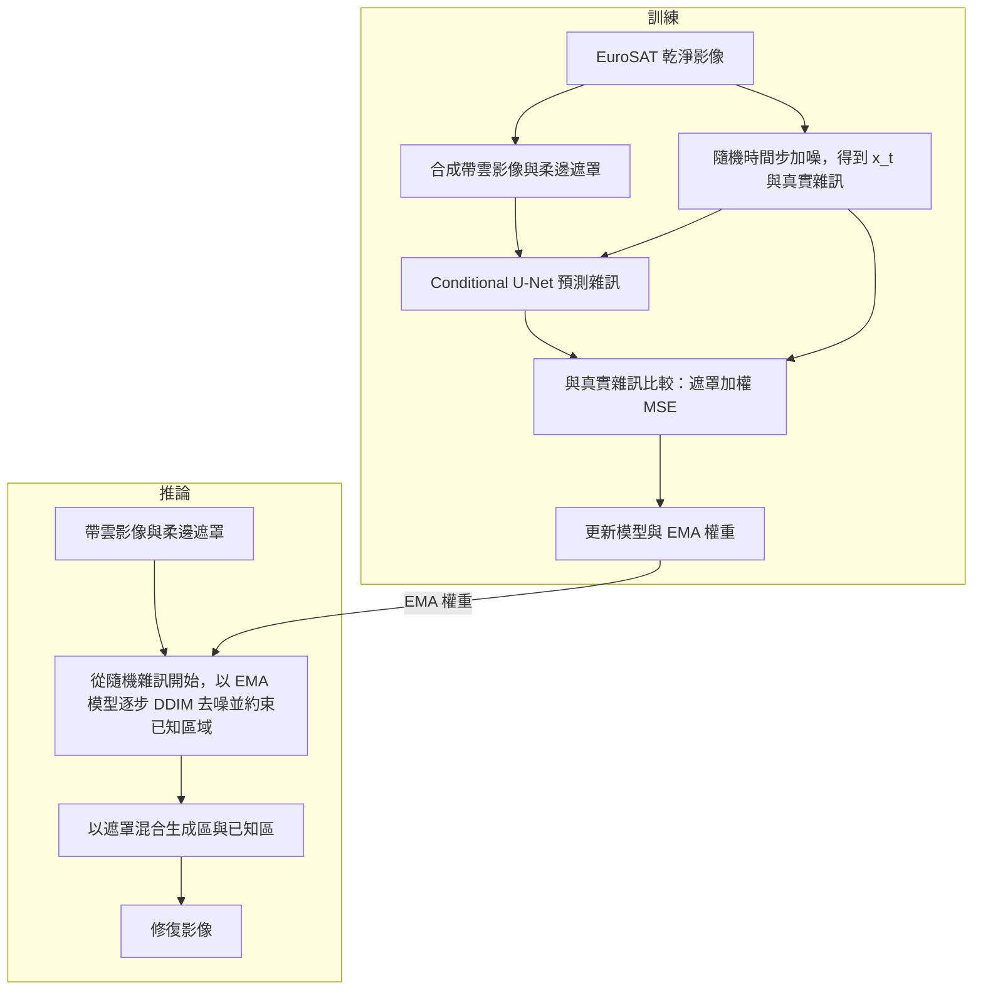

# SatCloudRestore

## 概述

SatCloudRestore 是以 PyTorch 實作的**合成雲衛星影像修復**專案：從 EuroSAT 的乾淨 RGB 影像產生帶雲影像與遮罩，訓練條件式擴散模型推測受遮蔽區域，並與傳統 Telea 修補法比較。專案提供資料準備、訓練與續訓、評估、Gradio Demo 及 [Colab notebook](notebooks/SatCloudRestore_Colab.ipynb)。

> **適用範圍：**衛星影像是真實的，但雲層是合成的。修復結果是模型推測，並不能視為厚雲下方的真實地理資訊。

## 方法

- **模型：**Conditional U-Net 接收加噪影像 $x_t$（3 通道）、帶雲影像（3 通道）及柔邊雲遮罩（1 通道），預測加入 $x_t$ 的雜訊。
- **訓練：**對乾淨影像隨機選擇時間步並加入高斯雜訊，以遮罩加權的雜訊 MSE 強調雲區；保存模型權重的 EMA 版本供推論使用。
- **推論：**主要設定採 200 步 cosine 擴散排程及 25 步 DDIM 取樣。每一步以帶雲影像約束未遮蔽區域，最後用柔邊遮罩混合生成結果與已知影像。

## 專案結構

主要檔案與目錄：

```text
SatCloudRestore/
├── app.py             # Gradio Demo 介面
├── satcloudrestore/   # 資料、合成雲、U-Net、擴散取樣、指標與視覺化模組
├── scripts/           # 資料準備、訓練、評估、雲層展示與流程驗證腳本
├── configs/           # 模型、資料切分、訓練與評估設定
├── notebooks/         # Colab 訓練、續訓、評估與 Demo 流程
├── tests/             # 資料切分、模型、取樣、指標與 checkpoint 測試
├── data/              # 資料集與切分清單
├── checkpoints/       # 模型權重、訓練紀錄與預覽圖
├── results/           # 評估指標、比較圖、GIF 與取樣變異圖
├── pyproject.toml     # 套件資訊與相依套件設定
├── requirements.txt   # 相依套件清單
└── LICENSE            # MIT 程式碼授權
```

## 流程



推論時使用訓練所得的 EMA 權重；測試則將修復影像與原始乾淨影像比較，並同時評估未修復輸入與 Telea 修補結果。

## 資料與結果

主要實驗使用 **64×64 RGB** 影像，固定切分為訓練 12,000、驗證 1,000、測試 1,000 張。訓練雲覆蓋率為 10%–60%；測試採 10%、30%、50%、70%，各 250 張。70% 是超出訓練範圍的壓力測試。

下表為現有本機 1,000 張測試紀錄的平均值；評估使用最佳 checkpoint、25 步 DDIM、每張取樣一次。大型結果檔未納入 Git。

| 方法 | 全圖 PSNR ↑ | 全圖 SSIM ↑ | 雲區 PSNR ↑ | 雲區 SSIM ↑ | 雲區 MAE ↓ |
|---|---:|---:|---:|---:|---:|
| 未修復 | 15.384 | 0.526 | 10.664 | 0.324 | 0.3023 |
| SatCloudRestore | 18.323 | 0.579 | 13.775 | 0.408 | 0.2140 |
| Telea | **21.583** | **0.636** | **17.748** | **0.496** | **0.1267** |

擴散模型優於未修復輸入，但在這組合成雲測試中仍落後 Telea。另以 32 張影像、每張 8 次取樣檢查變異圖，其變異與實際誤差的平均 Spearman 相關為 **−0.110**；變異圖不能當作經校準的信心或錯誤風險。

## Demo

Gradio Demo 使用已訓練的 checkpoint。可選測試影像或上傳 RGB 圖片，調整雲覆蓋率、不透明度、DDIM 步數、取樣次數與種子，查看遮罩、Telea 與擴散模型的修復結果、取樣變異圖及指標。**Demo 會先把選取或上傳的影像當作乾淨參考並加上合成雲**，因此顯示的指標只衡量這個合成雲任務。

